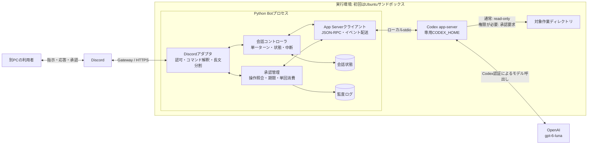
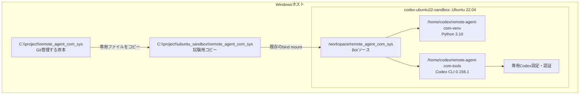
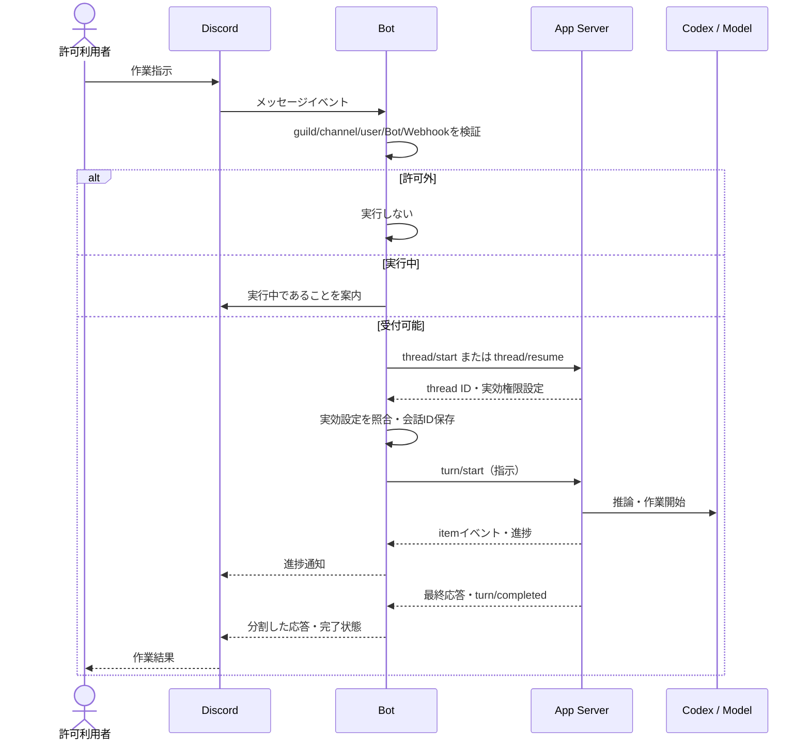
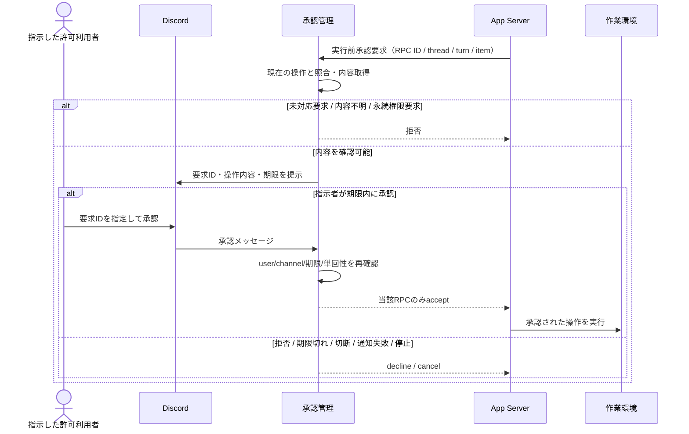
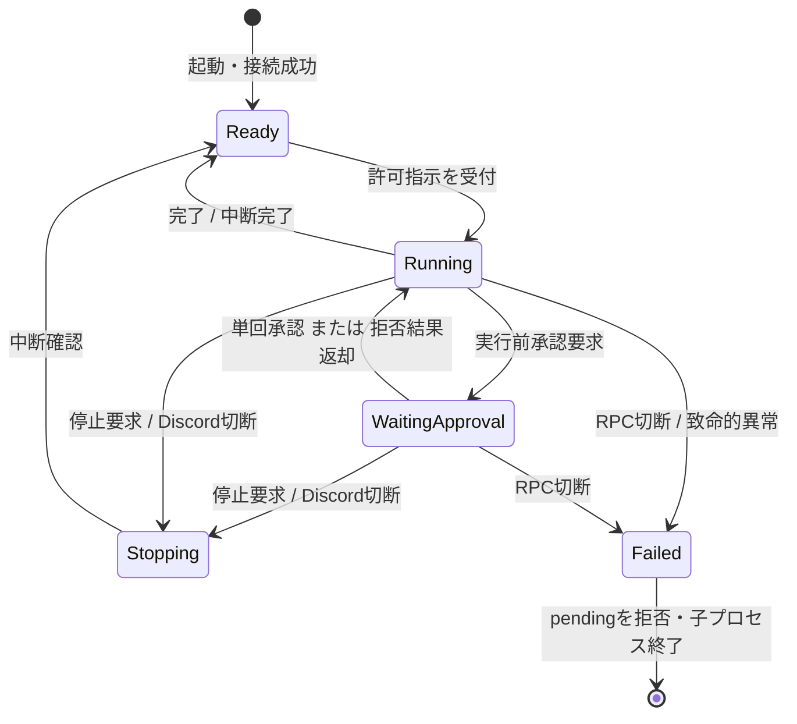

# SW仕様書: Discord遠隔Codex操作システム

## 1. 目的と実装方針

本書は[SPEC.md](SPEC.md)の要件をソフトウェアとして実現する構成、責務、インターフェース、状態遷移、異常処理を定義する。実装担当はGPT-6-Luna。通常の読み取りは制限されたCodex実行環境内で行い、信頼済みと判定されないコマンドや追加権限を要する操作はDiscordの明示承認を得る。CLI 0.156.1ではapprovalPolicy=untrusted、approvalsReviewer=user、sandbox=read-onlyを指定し、開始・再開時の実効設定を検証する。

このBotが起動するCodex app-serverの会話を管理する。既に別画面で動作中の任意のCodexセッションを自動操作する機能は対象外。試験版では同時実行1件、設定された1サーバー・1チャンネルを扱う。

## 2. システムアーキテクチャ

BotはDiscordへ接続する。ホスト向けHTTP公開ポートは不要。stdioはBotの子プロセスとの接続だけに用い、遠隔からJSON-RPCを直接呼べる経路は公開しない。

既存Dockerのホストマウント、ソケット、ポートを追加しない。試験用のコードコピーにGit履歴、.env、認証情報、状態ファイルを含めない。コンテナ内の操作権限とWindowsホスト全体の操作権限を混同しない。

## 3. コンポーネント責務

| コンポーネント | 責務 | 主な入出力 |
| --- | --- | --- |
| 設定 (`config.py`) | 環境変数の読込みと必須値・範囲検証 | Discord ID、実行先、モデル、期限 |
| Discordアダプタ | Bot/DM/Webhook排除、利用者認可、操作受付、通知 | メッセージ ↔ コントローラ |
| 会話コントローラ | 会話開始・再開、1ターン実行、中断、イベント解釈 | thread/start/resume、turn/start/interrupt |
| 承認管理 | 要求照合、期限、一度限りの判定、異常時拒否 | 承認要求 ↔ Discord承認・拒否 |
| RPCクライアント (`app_server.py`) | 子プロセス、JSON行単位のstdio、RPC ID照合、切断検知 | request / response / notification |
| 会話保存 (`session.py`) | 会話識別子の保存と読込み | JSONファイル。原子的な置換 |
| 監査 (`audit.py`) | 承認等の小さい運用記録 | JSONL。プロンプトや差分全文を除外 |

具体的なコマンド名・環境変数名は実装に合わせREADMEで定義する。実装完了時、本書の対応表も実ファイル名に同期する。

## 4. 指示・応答シーケンス

RPCの応答読取りをDiscord承認待ちで停止させない。イベントの順序を保ち、承認処理は独立に待機する。これにより承認待ちでも状態照会・停止を受け付ける。

## 5. 危険操作の承認シーケンス

fileChangeの承認要求には差分が含まれない場合があるため、同じitem IDの先行イベントから差分を取得して表示する。差分を照合できなければ拒否する。セッション全体承認、実行ポリシーの永続変更、grantRoot等の継続的な書込み許可は受け付けない。未対応の追加権限やツール要求は安全側で拒否する。

承認はCodexが提示した一回の操作に対する許可であり、スクリプト内部の各処理を別々に承認するものではない。承認したコマンド自体の内容を利用者が確認する。単なるフックや自然言語指示だけでは全実行経路を制御できないため、Codexの実行環境と承認プロトコルを使用する。

## 6. 状態管理

状態ファイルには会話識別子を保存する。再起動時に未承認要求を復元・実行せず、処理済み指示を自動再送しない。会話の再利用は設定された実行先とDiscordの運用単位が一致する場合に限る。

## 7. 異常処理とセキュリティ

| 事象 | 処理 |
| --- | --- |
| 許可外の送信元 | Codexへ指示を送らない |
| 同時指示 | 実行中と応答し、意図しない並列実行を防ぐ |
| 承認ID不明・期限切れ・再利用 | 実行許可を返さない |
| Discord切断・通知失敗 | pending承認を拒否し、実行中のターンを中断 |
| app-server終了・壊れたRPC | 待機を解消し、失敗状態にする |
| 起動後の実効権限が設定と異なる | 指示実行前に失敗させる |
| 長い応答・差分 | Discordの上限内に分割。操作内容を黙って省略した承認は禁止 |
| 認証情報がない | 明示的に案内。別モデル・別アカウントへ自動切替しない |

Discordトークンを子プロセス環境へ渡さない。認証情報はGit対象外に保管する。Botから送信するときはメンションを無効にする。既存のMCP・フック等を無条件に継承しない専用Codex設定を用いる。read-onlyで許される読み取り自体は承認対象外なので、作業環境に置く秘密情報とアクセス範囲は運用時に確認する。

## 8. 要件と実装・試験の対応

| 要件 | 実現方法 | 確認方法 |
| --- | --- | --- |
| Discordで指示・応答 | Discordアダプタ、会話コントローラ、JSON-RPC | 模擬メッセージ、イベント配送、実接続 |
| Discord指示に反応 | allowlist検証後のturn/start | 許可/拒否/実行中の試験 |
| 危険操作は承認後に実行 | read-only＋実行前承認のDiscord転送 | 承認/拒否/期限/切断/再利用の試験 |
| 別PCから進捗確認 | 進捗通知・状態照会 | 動作中/承認待ち/完了の確認 |
| 試験運用 | 専用コピーとvenv、既存Ubuntuコンテナ | Python自動試験・CLIプロトコル確認 |
| 低コストモデルで実装 | GPT-6-Lunaが全実装を担当 | 実装計画と作業記録 |

実試験の結果、未実施項目、制約は別の検証記録に残す。本書の予定だけをもって実機試験完了とはしない。

